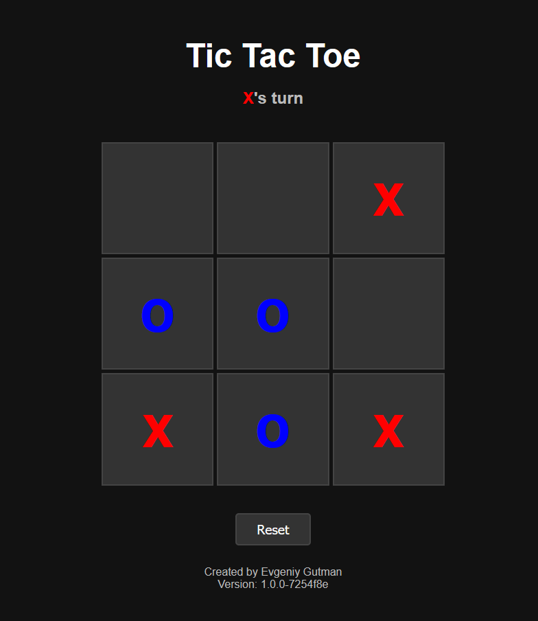

# Tic Tac Toe Game

A modern, responsive implementation of the classic Tic Tac Toe game built with HTML, CSS, and JavaScript.



## Features

- 🎮 Clean and modern user interface
- 📱 Fully responsive design - works on desktop and mobile devices
- ✨ Smooth animations and visual feedback
- 🎯 Win detection with highlighted winning line
- 🔄 Easy game reset functionality
- 🎨 Distinctive X and O colors (red and blue)

## Live Demo

You can play the game here: https://snipe76.github.io/IksI-Igul/

## Getting Started

### Prerequisites

No special prerequisites are needed! Just a modern web browser.

### Installation

1. Clone the repository:
   ```bash
   git clone https://github.com/Snipe76/IksI-Igul.git
   ```

2. Open `index.html` in your web browser

That's it! No build process or dependencies required.

## How to Play

1. The game starts with player X
2. Players take turns clicking on empty squares to place their mark (X or O)
3. The first player to get three of their marks in a row (horizontally, vertically, or diagonally) wins
4. If all squares are filled and no player has won, the game is a tie
5. Click the "Reset" button to start a new game at any time

## Project Structure

```
IksI-Igul/
├── css/
│   └── style.css
├── javascript/
│   ├── game.js
│   └── version.js
├── index.html
└── README.md
```

## Development

The project uses vanilla JavaScript with no external dependencies. The code is organized into separate files for better maintainability:

- `index.html`: Main HTML structure
- `style.css`: All styling and animations
- `game.js`: Game logic and event handlers
- `version.js`: Version tracking functionality

## Contributing

Contributions are welcome! Feel free to submit issues and pull requests.

## Author

**Evgeniy Gutman**

## Version History

Check the version number in the footer of the game. The version number is automatically updated with each commit.

## License

This project is open source and available under the [MIT License](LICENSE). 