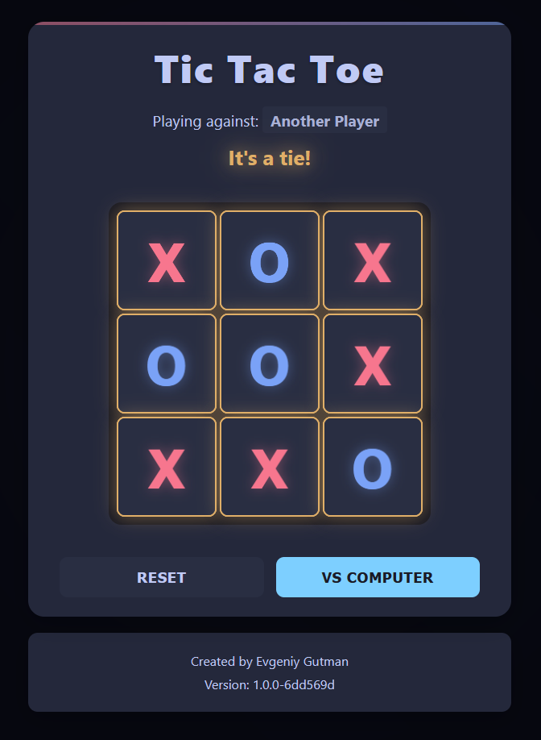

# Tic Tac Toe Game

A modern, responsive implementation of the classic Tic Tac Toe game built with HTML, CSS, and JavaScript. Experience smooth animations, intelligent AI, and a polished user interface.



## Features

### Game Modes
- 👥 Player vs Player - Challenge your friends
- 🤖 Player vs AI - Test your skills against the computer
- 🎮 Three AI Difficulty Levels:
  - Easy: Perfect for beginners
  - Normal: Balanced challenge
  - Hard: Strategic and competitive

### User Interface
- 🎨 Clean and modern design
- 📱 Fully responsive - works perfectly on all devices
- ✨ Smooth animations and visual feedback
- 🌈 Distinctive player colors and effects
- 🎯 Dynamic win line animations
- 🤝 Special tie game animations
- 🎉 Victory celebrations with confetti

### Mobile Experience
- 📱 Optimized touch controls
- 📐 Dynamic viewport handling (dvh units)
- 🔄 Smooth transitions and animations
- 🚫 Prevents unwanted zooming
- 💫 Mobile-specific visual feedback
- 🎮 Responsive button states

### Technical Features
- 🧠 Intelligent AI using minimax algorithm
- 🎯 Real-time difficulty adjustment
- ⚡ Optimized performance
- ♿ Accessibility features
- 🔄 Automatic version tracking
- 📊 Clean code architecture

## Live Demo

Try it now: [Play Tic Tac Toe](https://snipe76.github.io/IksI-Igul/)

## Getting Started

### Prerequisites

No special prerequisites needed! Just a modern web browser.

### Installation

1. Clone the repository:
   ```bash
   git clone https://github.com/Snipe76/IksI-Igul.git
   ```

2. Open `index.html` in your web browser

That's it! No build process or dependencies required.

## How to Play

1. Choose your game mode:
   - Click "vs Computer" to play against AI
   - Keep "vs Human" to play against a friend

2. When playing against AI:
   - Select your preferred difficulty level
   - Easy: AI makes random moves
   - Normal: AI plays defensively
   - Hard: AI plays strategically

3. Gameplay:
   - X always starts first
   - Click/tap any empty square to make your move
   - Get three in a row to win
   - Game automatically detects wins and ties

4. Additional Controls:
   - Use the Reset button to start a new game
   - Change AI difficulty anytime during computer mode
   - Switch between human and computer opponents

## Technical Details

### Modern Web Technologies
- Vanilla JavaScript with modular architecture
- Modern CSS features:
  - CSS Grid for game board
  - CSS Variables for theming
  - Dynamic viewport units (dvh)
  - Fluid typography with clamp()
  - Modern animations and transitions
- Mobile-first responsive design
- Semantic HTML with ARIA support
- Touch event optimization

### AI Implementation
- Minimax algorithm for decision making
- Multiple difficulty levels
- Optimized move calculation
- Strategic play patterns

### Responsive Design
- Fluid layouts using CSS Grid
- Dynamic sizing with clamp()
- Mobile-optimized interactions
- Breakpoint-specific enhancements
- Touch-friendly controls

## Project Structure

```
IksI-Igul/
├── css/
│   └── style.css      # Styles, animations, and responsive design
├── javascript/
│   ├── game.js        # Core game logic and event handling
│   ├── ai-player.js   # AI opponent implementation
│   └── version.js     # Automatic version tracking
├── index.html         # Semantic HTML structure
└── README.md         # Documentation
```

## Development

The project uses vanilla JavaScript with minimal dependencies:
- `confetti.js`: For win celebrations
- No other external dependencies

Key files and their purposes:
- `index.html`: Semantic markup with accessibility features
- `style.css`: Modern CSS with responsive design
- `game.js`: Game logic and mobile optimizations
- `ai-player.js`: Intelligent AI implementation
- `version.js`: Automatic version tracking

## Contributing

Contributions are welcome! Feel free to:
- Report bugs
- Suggest features
- Submit pull requests
- Improve documentation

## Author

**Evgeniy Gutman**

## Version History

The version number in the game footer updates automatically with each commit.

## License

This project is open source and available under the [MIT License](LICENSE). 